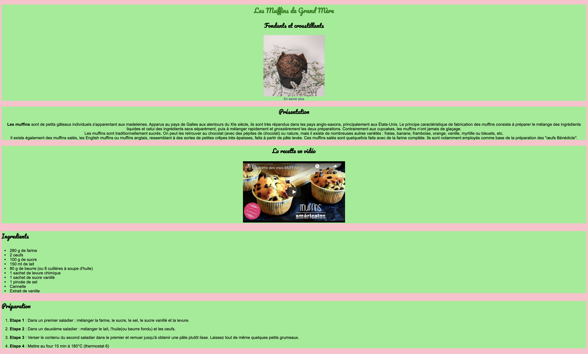

# Jour 2

### <a href="https://github.com/Joz84/ten-hours-of-html-css" target="_blank">Retour au menu principal</a>

## Lien vers la <a href="https://joz84.github.io/day-b.github.io/" target="_blank">démo</a>

## Les divisions
### Le cadre
Nous souhaitons créer un cadre avec un fond vert autour de chaque section. Pour cela nous avons besoin d'une nouvelle balise : la balise division ```<div></div>```. Par exemple pour la 1ère section :

#### HTML (l.10-16)
```html
 <div>
   <h1>Les Muffins de Grand Mère</h1>
   <h2>Fondants et croustillants</h2>
   
   <br>
   <a href="https://www.marmiton.org/recettes/recette_muffins-tres-simples_166385.aspx">En savoir plus</a>
 </div>
```
Il faut en suite ajouter le CSS associé pour ajouter modifier le style du cadre :

#### CSS
```css

```

Exercice : Encadrer les autres sections avec la balise ```<div>``` pour que celles-ci soient également cadrées comme présenté sur l'image ci dessous :


## Les classes

#### HTML (l.76-81)
```html
  <div>
    <h3>Suggestions</h3>
    
    
    
  </div>
```

## Corrections du code précédent

## Une palette de couleurs plus large
### Les différentes notations des couleurs
Il existe 4 manières différentes de définir une couleur :
* Le nom mais le nombre de couleur est limité, exemple: "pink".
* Le code exadecimal
* Le code rgb (red, green, blue)
* Le code rgba (red, green, blue, transparence). Le dernier paramètre varie entre 0 et 1 et permet de gérer la transparence.

```css
h3 {
 color: pink;
 color: #FFC0CB;
 color: rgb(255, 192, 203);
 color: rgba(255, 192, 203, 0.8);
}
```
<i>Remarque :</i> Pour obtenir différentes teintes de gris, il suffit d'utiliser le code rgb avec 3 fois le même nombre. Par exemple : color: rgb(125, 125, 125);

### Les générateurs de palette de couleurs 
* https://paletton.com/
* https://colorhunt.co/
* https://coolors.co/
* https://www.colourlovers.com/
* https://www.colorzilla.com/
* <a href="https://graphiste.com/blog/choisir-palette-couleurs" target="_blank">10 liens</a>

### Les générateurs de gradients
* https://uigradients.com/
* https://webgradients.com/
* https://cssgradient.io/
* https://www.colorzilla.com/gradient-editor/

### Les générateurs de background SVG
* https://www.svgbackgrounds.com/
* https://www.heropatterns.com/
* <a href="https://bashooka.com/coding/15-svg-css-background-pattern-resources/" target="_blank">15 liens</a>

### Armoniser les images avec les couleurs
* <a href="http://labs.tineye.com/multicolr/" target="_blank">labs.tineye.com</a>
* http://www.colr.org/

## De nouvelles propriétés CSS


